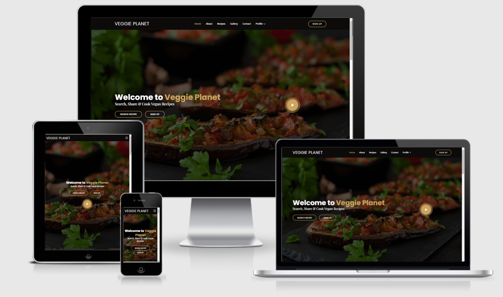

# Veggie Planet   

## Milestone Project 3 - Python and Data Centric Development 

[Link to Live Website](https://veggie-planet.herokuapp.com/)  
  

***   

## Index – Table of Contents  

  

* [About](#About) 

* [User Experience](#User-Experience)  

* [Features](#Game-Requirements) 

* [Technologies](#Technologies) 

* [Testing](#Testing) 

* [Deployment](#Deployment)   

* [Acknowledgements](#Acknowledgements) 

  
*** 

## About    

  

Veggie Planet is a project that is intended to be used for the scope of this project, and also outside of this project scope. As a proponent of the vegan lifestyle, I found it quite challenging to source out individual websites that compile a large amount of vegan recipes from various international cuisines. This is why Veggie planet was created. Not only to be a useful resource of vegan recipes, but also promote the vegan food, movement and lifestyle. This site is still work in progress as far as content is concerned, but for the scope of this project, I have opted to primarily design it as a vegan recipe cookbook, by the users, for the users, in which a user can search existing recipes, and also add, edit and delete their own recipes. 

***  

  
## Demo 

Clicking on this [link](https://veggie-planet.herokuapp.com/) provides access to the live website 

 

    

 

***

## User Experience 

This site targets visitors who are interested in vegan recipes, and would like to share recipes of their own to contribute to the ever growing database of recipes 

### Visitor Goals

* To be able to see different recipes and search for recipes using keywords.
* To create an account, be able to log into account
* To be able to add, edit and delete user's own recipes and contribute to database of vegan recipes

## Site Owner's Goals

* To promote vegan movement and vegan lifestyle
* To convince user that vegan food is very delicious
* To enlighten users about the contribution they're making towards environment
* To highlight the health benefit of a vegan diet
* To highlight substitutes for carnivorous diets.

## Strategy

The design goal is to make a clear, intuitive, accessible, structured websitesite that allows visitors to easily find recipes, ingredients, and instructions, have clear call to action buttons encounraging users to register in order to add, edit and delete their own recipes. Links between various pages are intended to be very intuitive to allow for easy navigation.

## Scope

The site consists of a home page comprised of a navigation bar, with a number of options available for all users, and a profile option consisting of a dropdown menu, that is only available to registered users. The profile section allows access to the user's own profile on which they can view their contribution of recipes, with the choice to edit or delete said recipes. It also allows access to the "Add Recipe" page in which a user can add a recipe title, recipe summary, number of servings, calories per serving, cooking and preperation time, ingredients and instructions. The sign Up button only appears to non-registered users. 

The hero section features two buttons, search recipes and signup, the latter of which is only visible to non-registered users, and a prominent play button that enables a video to play of well-renowned vegan activist Ed Winters, A.K.A. earthling Ed, dissecting the logic used to prevent the switch to a vegan diet in one of his popular TED Talks, which I thought was a very powerful to answer a lot of questions in a non-accusatory manner and appeals to the listener's logic.

The about section features a short brief regarding the mission of this site, clearly stating that one of it's primary functions is to compile a large database of vegan recipes from all over the world, followed by a "Why go vegan" section featuring three cards providing a very short summary of the benefits of a vegan diet.

In order to not sound very preachy, the featured section is intended to remind the user that this is a recipe site, and designed to choose random recipes from the database and feature them on a weekly basis, including recipe title, recipe summary and an image of the dish.

Following that is a section featuring a carousel that helps the user find plant alternatives to the standard carnivorous options, regarding meat, milk and eggs, with a button taking the user to the relevant page which then outlines the variety of plant options that can be incorporated into recipes.

Below is a table outlining what is visible to members and non members:

| Nav Bar   | Logged in | Not Logged in  |
| ----------|:------ :| -----:|
| Home      |  ✔      | ✔ |
| About     |  ✔      | ✔ |
| Recipes   |  ✔      | ✔ |
| Contact   |  ✔      | ✔ |
| Signup    |  ❌     | ✔ |
| Log in    |  ❌     | ✔ |