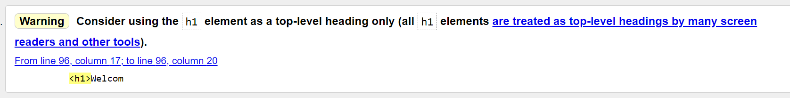
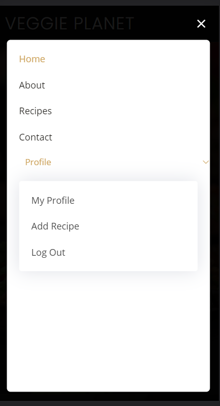
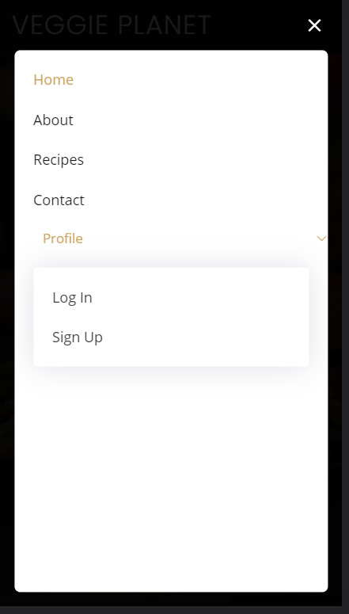
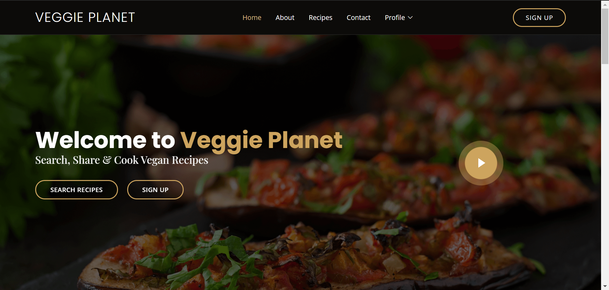
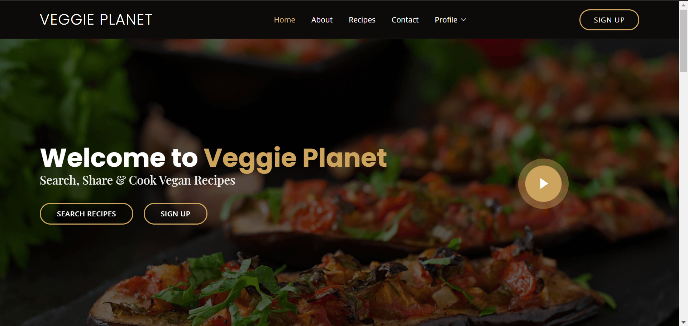
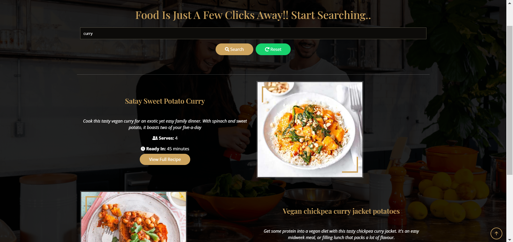
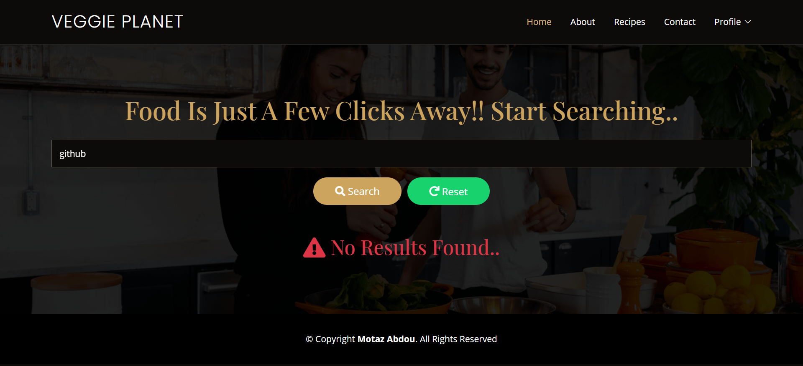
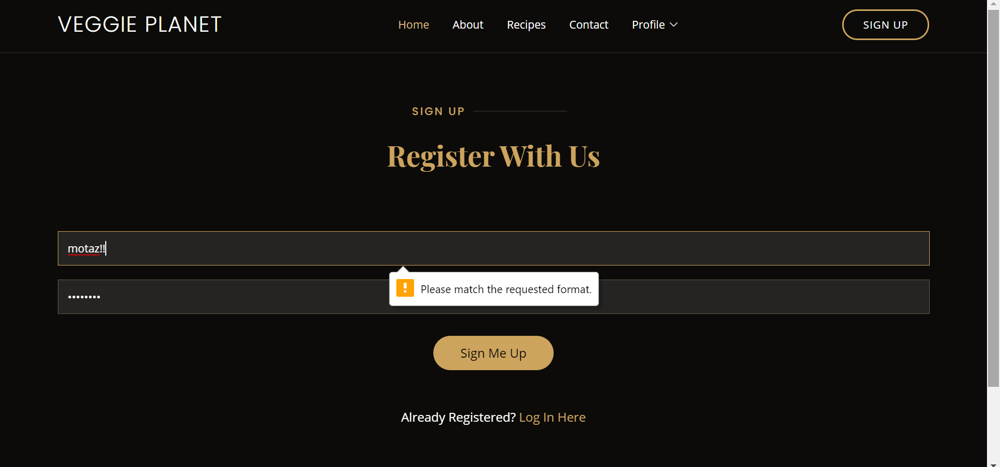
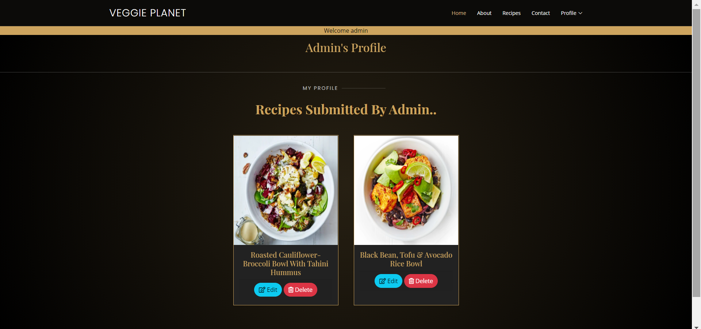
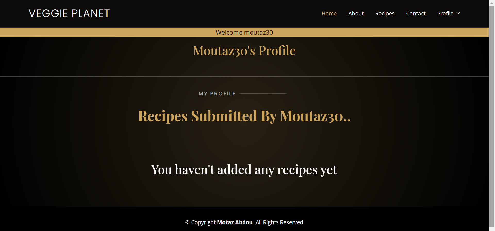

# Veggie Planet   

## Milestone Project 3 - Python and Data Centric Development 

[Link to Live Website](https://veggie-planet.herokuapp.com/)  
  

***   

## Index – Table of Contents  

  

* [About](#About) 

* [User Experience](#User-Experience)  

* [Features](#Game-Requirements) 

* [Technologies](#Technologies) 

* [Testing](#Testing) 

* [Deployment](#Deployment)   

* [Acknowledgements](#Acknowledgements) 

  
*** 

## About    

  

Veggie Planet is a project that is intended to be used for the scope of this project, and also outside of this project scope. As a proponent of the vegan lifestyle, I found it quite challenging to source out individual websites that compile a large amount of vegan recipes from various international cuisines. This is why Veggie planet was created. Not only to be a useful resource of vegan recipes, but also promote the vegan food, movement and lifestyle. This site is still work in progress as far as content is concerned, but for the scope of this project, I have opted to primarily design it as a vegan recipe cookbook, by the users, for the users, in which a user can search existing recipes, and also add, edit and delete their own recipes. 

***  

  
## Demo 

Clicking on this [link](https://veggie-planet.herokuapp.com/) provides access to the live website 

 

    

 

***

## User Experience 

This site targets visitors who are interested in vegan recipes, and would like to share recipes of their own to contribute to the ever growing database of recipes 

### The Ideal Customer For This Site Is:
* Vegan looking for a collection of vegan recipes
* Vegan looking for more info about vegan food and lifestyle
* Vegan looking for alternatives to dairy, meat or general animal products
* Vegan seeking to promote awareness of the vegan diet
* Non-vegan looking to explore vegan food options
* Non-vegan seeking information on plant alternatives to try out

### Visitor Goals

* To be able to see different recipes and search for recipes using keywords.
* To create an account, be able to log into account.
* To be able to add, edit and delete user's own recipes and contribute to database of vegan recipes.
* To be able to easily navigate throughout the site through clean, interactive presentation
* Allow users to identify this site as a promising collection of vegan recips which are challenging to find compiled in a single site
* Most sites don't make a clear distinction between vegan and vegetarian

### Site Owner's Goals

* To promote vegan movement and vegan lifestyle
* To convince user that vegan food is very delicious.
* Allow user to know that alternatives are well within reach.
* Answer some common questions through use of video and pages dedicated to plant based alternatives.
* To enlighten users about the contribution they're making towards environment
* To highlight the health benefit of a vegan diet
* To highlight substitutes for carnivorous diets.

### Strategy

The design goal is to make a clear, intuitive, accessible, structured websitesite that allows visitors to easily find recipes, ingredients, and instructions, have clear call to action buttons encounraging users to register in order to add, edit and delete their own recipes. Links between various pages are intended to be very intuitive to allow for easy navigation.

### Scope

The site consists of a home page comprised of a navigation bar, with a number of options available for all users, and a profile option consisting of a dropdown menu, that is only available to registered users. The profile section allows access to the user's own profile on which they can view their contribution of recipes, with the choice to edit or delete said recipes. It also allows access to the "Add Recipe" page in which a user can add a recipe title, recipe summary, number of servings, calories per serving, cooking and preperation time, ingredients and instructions. The sign Up button only appears to non-registered users. 

The hero section features two buttons, search recipes and signup, the latter of which is only visible to non-registered users, and a prominent play button that enables a video to play of well-renowned vegan activist Ed Winters, A.K.A. earthling Ed, dissecting the logic used to prevent the switch to a vegan diet in one of his popular TED Talks, which I thought was a very powerful to answer a lot of questions in a non-accusatory manner and appeals to the listener's logic.

The about section features a short brief regarding the mission of this site, clearly stating that one of it's primary functions is to compile a large database of vegan recipes from all over the world, followed by a "Why go vegan" section featuring three cards providing a very short summary of the benefits of a vegan diet.

In order to not sound very preachy, the featured section is intended to remind the user that this is a recipe site, and designed to choose random recipes from the database and feature them on a weekly basis, including recipe title, recipe summary and an image of the dish.

Following that is a section featuring a carousel that helps the user find plant alternatives to the standard carnivorous options, regarding meat, milk and eggs, with a button taking the user to the relevant page which then outlines the variety of plant options that can be incorporated into recipes.

Below is a table outlining what is visible to members and non members:

| Nav Bar        | Logged In           | Logged out  |
| ------------- |:-------------:| -----:|
| Home      | ✔ | ✔ |
| About      | ✔      |   ✔ |
| Recipes | ✔      |    ✔ |
| Contact | ✔      |    ✔ |
| Signup | ❌      |    ✔ |
| Log in | ❌      |    ✔ |
| Log Out | ✔      |    ❌ |
| My Profile | ✔      |    ❌ |
| Add Recipe | ✔      |    ❌ |

Accessing the "My Profile" page enables user to edit or delete recipe, both of which are also options not availabe to non members

### Design Structure
The website used a template that is free to use by [BootstrapMade](https://bootstrapmade.com/) called Restaurantly, after receiving permission to use this template for the purposes of my project. I have however modified the template and tailored it to my own needs, using slightly different colour schemes and free/license-free images from [Unsplash](https://unsplash.com/). The template comes with a few libraries including bootstrap, animate css for smooth animations, swiper touch slider, but I have also decided to use AOS on-scroll animation library, glightbox for interactive image animations on hover.

### Fonts
Three fonts from google fonts have been used to embed the following fonts: 

* "Poppins" for H1's that have been made to have a small font for a more modern feel. 
* "Playfair Display" for headers, which in fact are a further elaboration of the H1 title, and 
* "Open Sans" for content including paragraphs, list items including recipe methods, ingredients and Navbar list items.  

### Colours

The main colours used were various shades of black using RGBA, and in order to break the contrast, #cda45e, a version of beige has been used for buttons, headers, borders of a variety of elements including input fields.

### Icons

I have used [Font Awesome](https://fontawesome.com/) for all of the icons I have used throughout the website.

***

## Features

### Existing Features

* See overview of multiple recipes, by displaying title, summary, image, servings and cooking time
* See specific recipe details by clicking on view recipe button
* Clear, intuitive page navigation
* Call to action buttons on header, hero section and alternatives section guiding the user toward's site's intended goals
* Educational features presented using interactive elements such as slider, cards, and video button
* play button giving user to play video concerning common arguments regarding veganism.
* Use of images and scroll animations for a greater user experience
* Register account, log in and log out features
* View, add, edit and delete recipes
* Contact form requesting user's name, email, subject and message and a send button
* Header with logo and navigation list items that exists on every page of the site
* Footer section that exists on every page throughout the site

### Features To Be Incorporated In The Future

* Using vegan recipe API for a rich database
* Allow users to search recipes based on categories
* Allow users to comment on recipes 
* Incorporate blog to allow members to discuss relevant matters
* Incorporate share features to allow users to share recipes and pages on social media
* Favourite button that allows users to save preferred recipes and view saved recipes on their profiles
* Provide print-only version of recipes that allows users to print favourite recipes
* Incorporate section that allows users to enter available ingredients and suggest a recipe based on entered ingredients
* Integrate FAQ page for more commonly asked questions.
* Change site language option to draw in more users from all around the globe

***

## Technologies

### Languages

* HTML
* CSS
* JavaScript
* Python

### Libraries & Frameworks

* Bootstrap
* Animate.css
* Aos scroll animations
* Swiper.js
* jQuery
* PyMongo
* Flask
* Jinja
* Werkzeug

### Wireframes

* Balsamiq
* Adobe Photoshop 

### Tools

* Adobe Photoshop - Wireframe and save images for web
* Tinypng - Compress images for faster loading
* [Imgbb](https://imgbb.com/) - To store images and get image URLs for recipes
* Gitpod - Writing code
* EmailJs - Turning user form input into email received
* Github - Repository
* Heroku - Host for project deployment
* MongoDb - Database used for website
* VSCode & Atom - For testing out tricky code prior to writing on Gitpod

***

## Testing

### HTML & CSS Testing

* I have used [W3C Makrkup Validator](https://validator.w3.org/) to validate HTML code
* I have used [W3C CSS Validator](https://validator.w3.org/) to validate HTML code

 

    

The website passed all validation tests, but however displayed a warning for not using a h1 tag as a top level header only. However, I have dismissed this warning as this is how the theme is intended and styled, where the h1 tag appears to be with a smaller font than proceeding tags, due to the styling applied to it for a modern look and feel to the website. Otherwise, there have been no errors.

### Manual Testing

The design goal is to make a clear, accessible, structured site so that visitors can easily read the displayed recipes, make an account and add, edit and delete their own recipes.

On small and medium devices the menu can be accessed through the hamburger menu, on large devices the navigation menu is always visible. There is a difference between the menu for a user who is not logged in and a user who is logged in. The signup call to action button disappears, the logged out user is left with the option to signup or login, while the logged in user is given the option to view profile, add recipe or log out.

 
    
    

And on the desktop version..

 
    

 
    

#### The visitor goals are:

* To be able to search for recipe using keyword, and be told that no results were found should the keyword entered be invalid

 
    

 
    

In order to log in or signup, the user has to meet certain criteria in order to be validated. The forms work as expected and produce a message prompting the user to meet the input criteria, i.e. no spaces allowed, or special characters in the username. The input fields also have a minimum and maximum length

 
    

 
    

Once a user is logged in, they are directed to their own profile page, where a flash message greets the user, and the submitted recipes are presented in the form of cards, 4 of which stack in a row on large screen, 2 cards per screen on medium devices and one card per screen on mobile devices. If the user hasn't submitted any entries yet, that is relayed through a message on the profile page

 
    

 
    

